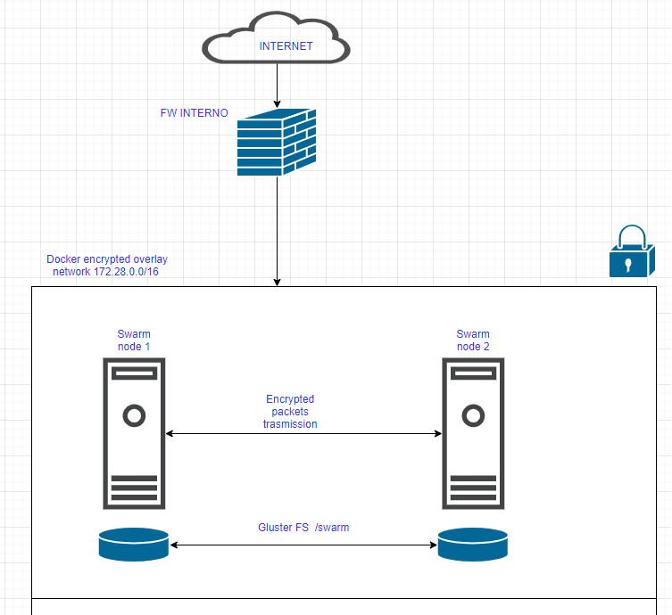

README.md
## Introduzione
Ambiente per installazione suite Farbooking > 2.11 + eventuale lockers e welcome tramite playbook ansible playbook-FB.yml in ambiente Onpremise
L'installazione prevede un docker swarm a 2 nodi con storage condiviso tramite glusterFS

## Prerequisiti
- N. 2 virtual machines
- 80 GB HD dedicati all'applicativo, preferibilmente in FS separato per prevenire il blocco della VM in caso di riempimento applicativo
- Vnic con accesso completo ad internet

## Image versioning
Nel file image_vars.yml è possibile controllare le versioni di tutte le app che si vogliono installare (lasciare commentata la riga relativa all'app in caso venga skippata l'installazione della stessa)

## Roles
Vengono sfruttati i ruoli ansible, nel playbook principale (playbook-FB.yml) è sufficiente commentare la parte di include_role per non inlcudere il tasks 

## Security/Network
Durante l'esecuzione del playbook viene attivato il firewall interno alle macchine con tutte le regole necessarie alla VLAN vmware + rete interna Docker (alcune nel ruolo fw-initial-setup altre per docker + gluster)
La rete interna docker è una overlay encrypted, questo richiede una particolare configurazione per evitare che i pacchetti criptati vengano scartati dalle interfacce (parte #For permit crypted traffic between nodes, if you want skip this part don't use encrypted network del playbook)

# Redeploy

è possibile effettuare il redeploy di una singola app , definendo la extra vars redeploy(array) inserendo all'interno la/le app che si vogliono re-deployare (esempio welcome-core)

    ansible-playbook playbook-FB.yml -i d2nodes_inventory.yml  --extedeploy={welcome_core}"
